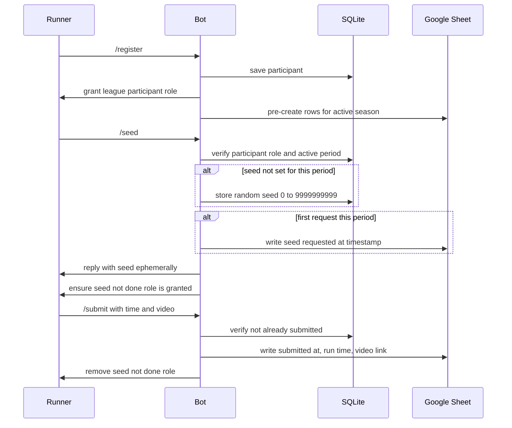
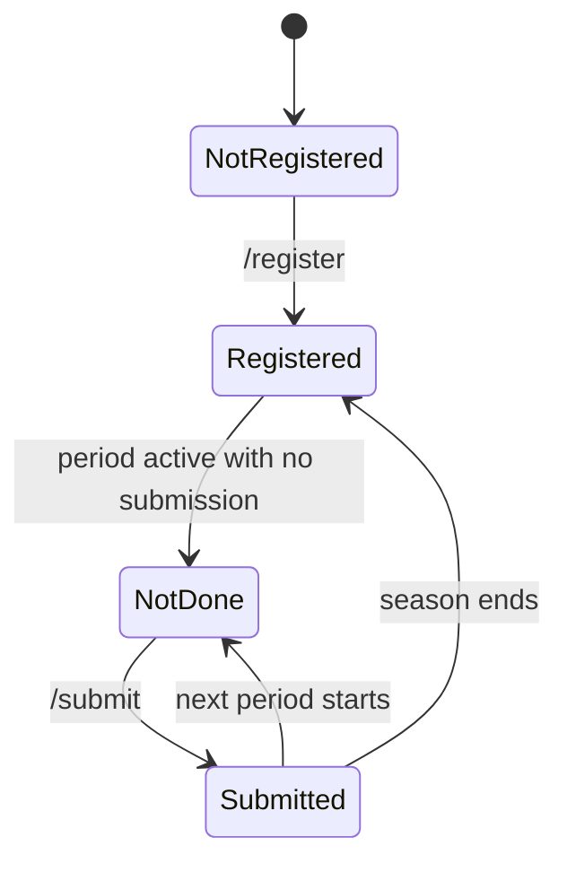

# Async Speedrun League Bot — Plan

## Overview
A Discord bot (Python 3.11+ / discord.py 2.x) for an asynchronous speedrun league:

- Admin creates a **season**: period length, number of periods, start time of the first period.
- Participants **self-register**, **request the shared RNG seed** for the active period, and **submit a time + video link**.
- The bot logs seed requests and submissions in a **Google spreadsheet**: one row per (period, participant) with seed-requested-at, submitted-at, run time, and video link.
- The bot manages two roles:
  - `league participant` — gate for requesting seeds / submitting.
  - `league seed not done` — granted while the participant has NOT submitted this period.
- A **seed discussion channel** is hidden ONLY from members with `league seed not done`: visible to non-participants and to participants who already submitted (spoiler protection for those still running).
- Seeds: one shared seed per period, random integer **0–9999999999 inclusive**.

## Key decisions

| Topic | Decision |
|---|---|
| Language / lib | Python 3.11+, discord.py 2.x, guild-scoped slash commands |
| Operational state | SQLite (stdlib `sqlite3`), single file `league.db` |
| Sheet access | `gspread` + Google **service account** (JSON key in `.env`); one spreadsheet ID configured, one **tab per season** |
| Seed | One per period for the whole league, `secrets.randbelow(10**10)`, delivered as an **ephemeral** reply |
| Sheet rows | Pre-created for every registered participant × every period when a season starts; updated in place |
| Timestamps | Recorded in **UTC ISO 8601** in the sheet |
| Submissions | Final per period; a second `/submit` in the same period is rejected |
| Registration | Persistent across seasons; starting a new season pre-creates rows for all existing participants |
| Roles | Auto-created by the bot during `/setup`; names configurable in `.env` |

## Data model (SQLite)

- `seasons(id, period_length_seconds, num_periods, start_at_utc, created_at)` — one active season at a time (new `/create-season` supersedes/ends the previous).
- `participants(discord_id PK, display_tag, registered_at)` — persistent registration.
- `period_records(id, season_id, period_index, discord_id, seed, seed_requested_at_utc, submitted_at_utc, run_time, video_url)` — `UNIQUE(season_id, period_index, discord_id)`. `seed` is set once per period.
- `settings(key PK, value)` — cached role IDs, sheet tab ID, seed-discussion channel ID.

## Sheet layout (one tab per season)

Columns: `Period | Period Start (UTC) | Period End (UTC) | Participant | Discord ID | Seed | Seed Requested At (UTC) | Submitted At (UTC) | Run Time | Video`

- Rows pre-created blank at season start; `Seed Requested At` written once (first request only); submission columns written once.

## Commands

**Admin** (gated by an admin role ID or user ID list from `.env`):
- `/setup` — create both roles, optionally apply the seed-channel permission overrides (pass the channel).
- `/create-season period_length:<e.g. 7d> periods:<int> start:<ISO datetime or now>` — starts the season, pre-creates sheet tab + rows for all registered participants.
- `/season-info` — current season, active period index, period start/end, registered count.
- `/add-participant <user>` / `/remove-participant <user>` — manual registration management.

**Participants:**
- `/register` — grants `league participant`; pre-creates their rows for the active season.
- `/seed` — requires participant role + active period. Generates the period seed if unset; records the **first** request timestamp in the sheet; replies with the seed **ephemerally**; ensures `seed not done` is granted.
- `/submit time:<M:SS.mmm or seconds> video:<url>` — requires participant role + active period + no existing submission. Validates time format and URL; writes submission timestamp, run time, video link; removes `seed not done`.

## Role & permission design

- `league participant`: granted on register, removed on `/remove-participant`.
- `league seed not done`: event-driven (grant on register/period start if unsubmitted, remove on submit) **plus** a periodic reconciliation task (every 30 min + on period boundary) so state self-heals.
- Seed channel overrides: `@everyone` → view allow; `league seed not done` → view **deny**. Discord resolves deny-over-allow, yielding exactly: non-participants and submitters can see it; unsubmitted participants cannot.

## Flows





## Project layout

```
async-league-bot/
├── main.py            # bot entry point, client setup, task start
├── config.py          # .env loading + validation
├── db.py              # SQLite schema + query helpers
├── periods.py         # season/period math from the clock
├── roles.py           # role ensure/grant/revoke + reconciliation
├── sheets.py          # gspread sync (tab create, row write, cell update)
├── cogs/
│   ├── admin.py       # /setup /create-season /season-info /add /remove
│   └── participant.py # /register /seed /submit
├── requirements.txt
├── .env.example
├── README.md
└── plans/
```

## Assumptions (flag if wrong)
1. Sheet timestamps in UTC.
2. Seed delivered via ephemeral reply (not DM).
3. One shared seed per period for all runners.
4. Registration persists across seasons (no re-register per season).
5. Submission is final for a period (no edits).

## Setup steps (README will document)
1. Discord application: bot token, invite URL with `applications.commands` + `manage roles` scopes.
2. Google Cloud: service account + JSON key; share the league spreadsheet with the service account email as **Editor**; put spreadsheet ID in `.env`.
3. In Discord: run `/setup` to create roles; create the seed discussion channel and pass it to `/setup` to apply permission overrides.
4. Run: `python main.py` (single instance only).
